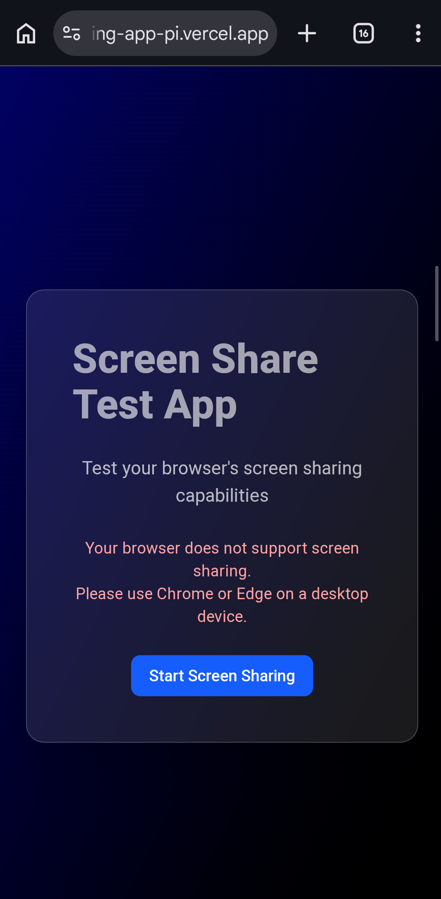

# 🖥️ Screen Share Test App

A frontend application built with **React + Vite + TypeScript** that demonstrates browser screen-sharing permissions, media stream lifecycle management, and robust success/failure state handling — using only native browser Web APIs.

🔗 **Live Demo:** [https://screen-sharing-app-pi.vercel.app](https://screen-sharing-app-pi.vercel.app)
📁 **Repository:** [https://github.com/thearsalan1/Screen-sharing-app](https://github.com/thearsalan1/Screen-sharing-app)

---

## 📸 Screenshots

### Homepage — Desktop


### Homepage — Mobile (Unsupported Browser)


### Screen Test — Ready (Idle State)


### Screen Test — Requesting (Picker Open)


### Screen Test — Picker Dialog (Browser Native UI)


### Screen Test — Active (Sharing Live)


### Screen Test — Stopped


### Screen Test — Permission Denied


---

## ⚙️ Setup Instructions

### Prerequisites
- Node.js v18 or higher
- npm v9 or higher
- Chrome or Edge browser (for screen sharing)

### Installation

```bash
# 1. Clone the repository
git clone https://github.com/thearsalan1/Screen-sharing-app.git

# 2. Navigate into the project
cd Screen-sharing-app

# 3. Install dependencies
npm install

# 4. Start the development server
npm run dev
```

The app will be running at `http://localhost:5173`

### Build for Production

```bash
npm run build
npm run preview
```

---

## 🔄 Screen Sharing Flow

Here is a step-by-step explanation of exactly how the screen sharing works in this app:

### Step 1 — Browser Support Check (Homepage)
When the user clicks **"Start Screen Sharing"** on the homepage, the app first checks:
```js
navigator.mediaDevices?.getDisplayMedia
```
If this API is not available (e.g. mobile browser or old browser), a warning message is shown immediately and navigation is blocked. If supported, the user is navigated to `/screen-test`.

### Step 2 — Permission Request (Screen Test Page)
On the screen test page, clicking **"Start Screen Share"** calls:
```js
navigator.mediaDevices.getDisplayMedia({
  video: { frameRate: { ideal: 30 } },
  audio: false
})
```
The browser opens its native screen picker dialog. The UI immediately reflects the `requesting` state — showing a spinner and "Waiting for you to select a screen..." message.

### Step 3 — State Handling
The app handles 7 distinct states based on what the user does:

| State | What happened | UI shown |
|---|---|---|
| `idle` | Nothing yet | Start button |
| `requesting` | Picker is open | Spinner + waiting message |
| `granted` | Screen selected | Live video preview + metadata |
| `cancelled` | User closed picker | Orange message + retry button |
| `denied` | Permission blocked | Red message + retry button |
| `stopped` | Stream ended | Stopped message + retry/home buttons |
| `error` | Unexpected error | Error message + retry button |

### Step 4 — Live Preview & Metadata
Once sharing starts:
- The stream is attached to a `<video>` element via `videoRef.current.srcObject = stream`
- `track.getSettings()` is called to extract:
  - **Resolution** — `settings.width` × `settings.height`
  - **Display type** — `settings.displaySurface` (mapped to: Browser Tab / Application Window / Entire Screen)

### Step 5 — Lifecycle Detection
The app listens for the stream ending via:
```js
track.onended = () => {
  cleanup()
  setStatus('stopped')
}
```
This fires whether the user clicks "Stop sharing" in the browser's native floating bar OR the browser ends the stream unexpectedly. The UI updates instantly, all tracks are stopped, and the video element is cleared.

### Step 6 — Cleanup
When the component unmounts (user navigates away), a `useEffect` cleanup runs:
```js
useEffect(() => {
  return () => cleanup()
}, [])
```
This ensures no media tracks are ever leaked, even if the user navigates away mid-share.

### Step 7 — Retry Flow
After stopping, the user can:
- **Retry Screen Test** — calls `startSharing()` fresh with a new `getDisplayMedia` request. Old stream is fully cleaned up first.
- **Back to Home** — navigates to `/`

---

## 🏗️ Project Structure

```
src/
├── hooks/
│   └── useScreenShare.ts      ← All screen sharing logic isolated here
├── components/
│   ├── Button.tsx             ← Reusable button (primary/secondary/danger)
│   ├── StatusBadge.tsx        ← Colored pill showing current state
│   ├── VideoPreview.tsx       ← Live <video> element with srcObject management
│   └── StreamMetadata.tsx     ← Displays resolution + display type
├── pages/
│   ├── Home.tsx               ← Route: / (support check + navigation)
│   └── ScreenTest.tsx         ← Route: /screen-test (main test page)
├── App.tsx                    ← Route definitions
└── main.tsx                   ← Entry point with BrowserRouter
```

---

## 🛠️ Tech Stack

| Technology | Purpose |
|---|---|
| React 18 | UI framework |
| Vite | Build tool |
| TypeScript | Type safety (bonus requirement) |
| Tailwind CSS | Styling |
| React Router v6 | Client-side routing |
| Web APIs only | `getDisplayMedia`, `MediaStream`, `MediaStreamTrack` |

---

## ⚠️ Known Limitations & Browser Quirks

### 1. `displaySurface` not available in Firefox
The `displaySurface` property (which tells you if the user shared a tab, window, or entire screen) is only available in **Chrome and Edge**. In Firefox, `track.getSettings().displaySurface` returns `undefined`, so the app falls back to showing "Unknown" as the display type.

### 2. `cancelled` vs `denied` detection is inconsistent across browsers
Both user cancellation and OS-level permission denial throw a `NotAllowedError`. The app attempts to distinguish them using the error message text — if the message contains "denied" or "blocked", it's treated as `denied`; otherwise as `cancelled`. However, this is not guaranteed across all browsers and OS versions and should be treated as a best-effort distinction.

### 3. Screen sharing not supported on mobile
The `getDisplayMedia` API is not available on mobile browsers (iOS Safari, Android Chrome). The app detects this on the homepage and shows an unsupported message instead of navigating.

### 4. `frameRate` may not match the requested ideal
The app requests `{ frameRate: { ideal: 30 } }` but the actual frame rate depends on system performance, browser implementation, and the type of content being shared. The browser may grant a lower frame rate without error.

### 5. HTTPS required
`getDisplayMedia` only works on **secure origins** (HTTPS or localhost). The app will not work on plain HTTP in production.

---

## 🌐 Browser Support

| Browser | Supported |
|---|---|
| Chrome (desktop) | ✅ Full support |
| Edge (desktop) | ✅ Full support |
| Firefox (desktop) | ⚠️ Works but `displaySurface` unavailable |
| Safari (desktop) | ⚠️ Limited support |
| Mobile browsers | ❌ Not supported |

---

## 📦 Deployment

This app is deployed on **Vercel**.

To deploy your own instance:
```bash
# Install Vercel CLI
npm install -g vercel

# Deploy
vercel
```

Or push to GitHub and import on [vercel.com](https://vercel.com) — it auto-detects Vite with no extra configuration needed.

---

## 📄 License

MIT
